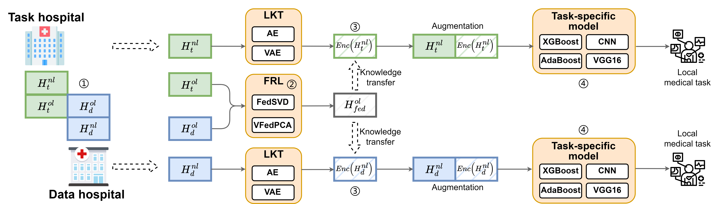

<h1 align="center">
  <b>VFedUF</b> 
</h1>

**Paper: Vertical Federated Knowledge Transfer via Representation Distillation for Healthcare Collaboration**

**Update 2022/11/16:** The code will soon be open source!

### 1. Requirements
+ Python == 3.8.10
+ PyTorch == 1.10.0+cu133
+ scikit-learn == 1.0.2
+ xgboost == 1.5.0
+ CUDA enabled computing device

### 2. Overview

